# BI-PFE-Project

## Résumé du projet
Le projet consiste à concevoir et déployer une solution complète de **Business Intelligence (BI)** pour l'analyse des performances des **centres de formation professionnelle au Maroc**.  
L'objectif principal est de fournir aux décideurs un **outil fiable et centralisé** pour suivre, analyser et comparer les résultats des différents centres de formation.

Cette solution BI repose sur :  
- Un **Data Warehouse** construit selon le modèle **Inmon**, permettant l’intégration et la consolidation des données provenant de plusieurs sources.  
- Des **Data Marts spécifiques** créés pour chaque domaine d’analyse afin de faciliter les requêtes et les rapports thématiques.  
- Des processus **ETL** pour l'extraction, la transformation et le chargement automatique des données, garantissant **qualité, cohérence et fraîcheur** des informations.  
- Des **cubes OLAP multidimensionnels** via **SQL Server Analysis Services (SSAS)** pour des analyses détaillées selon différents axes : centres, catégories, périodes, indicateurs de performance.  
- Des **tableaux de bord et visualisations** réalisés avec **Power BI**, offrant une présentation claire et intuitive des indicateurs clés.  

Le déploiement final a été effectué sur **Power BI Service** et **Report Server**, avec mises à jour automatiques via **SQL Server Agent**, garantissant un accès sécurisé et continu aux utilisateurs.

---

## Architecture du projet

### Modèle Inmon
L'architecture suit le **modèle Inmon**, avec :  
- **Data Warehouse central** consolidant toutes les données.  
- **Data Marts thématiques** pour chaque domaine.  
- Processus ETL automatisés pour la synchronisation des données.  

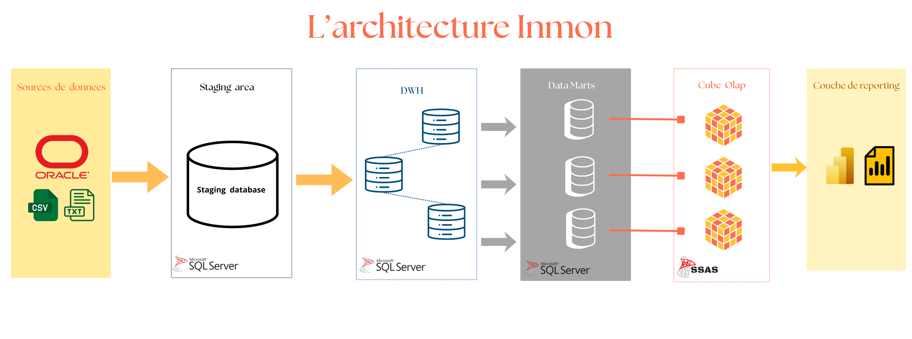

---

## Data Marts
Des **Data Marts** ont été créés pour faciliter les analyses spécifiques :  
- Chaque Data Mart contient des **tables de faits** et des **tables de dimensions** adaptées aux indicateurs de performance.

  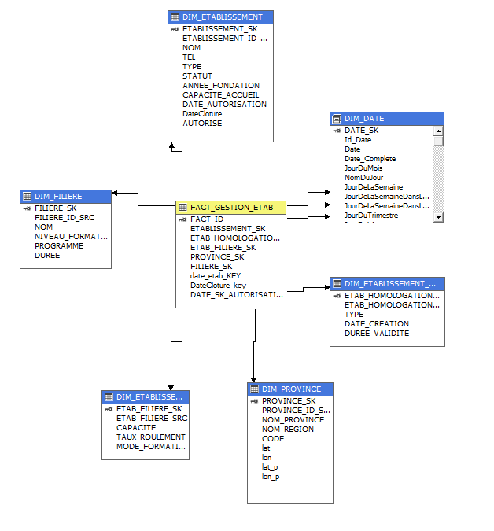
  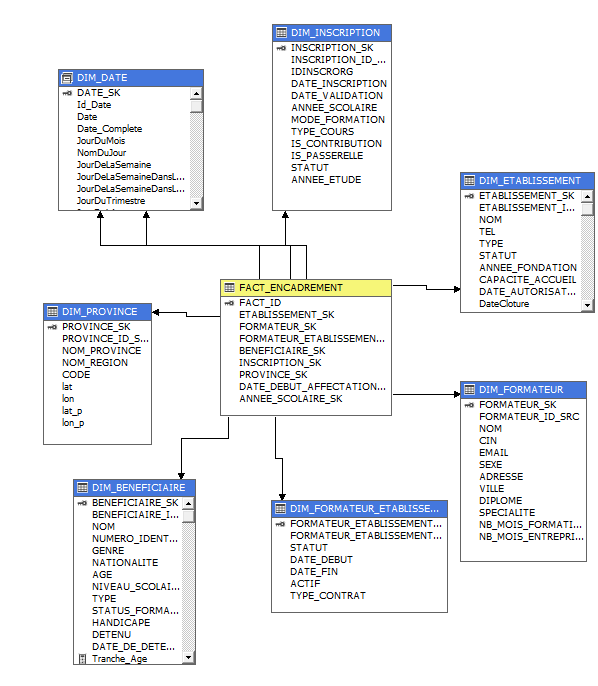
  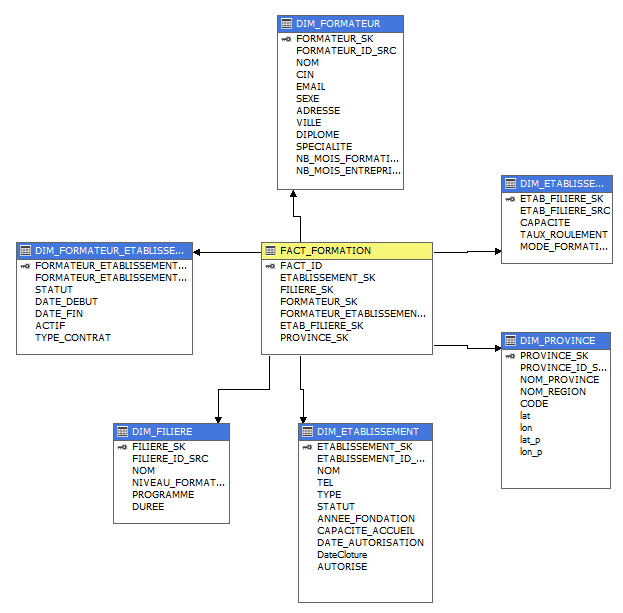
  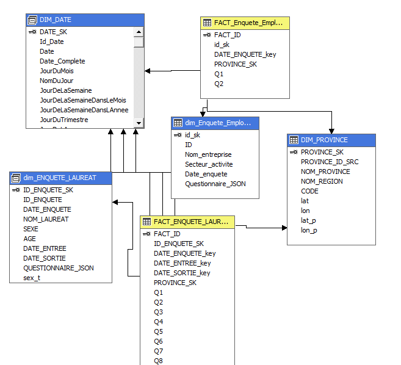

---

## Cubes OLAP et SSAS
Les cubes OLAP permettent :  
- Des analyses multidimensionnelles sur les centres, catégories, périodes et indicateurs.  
- L’utilisation du langage **MDX** pour requêtes complexes.  

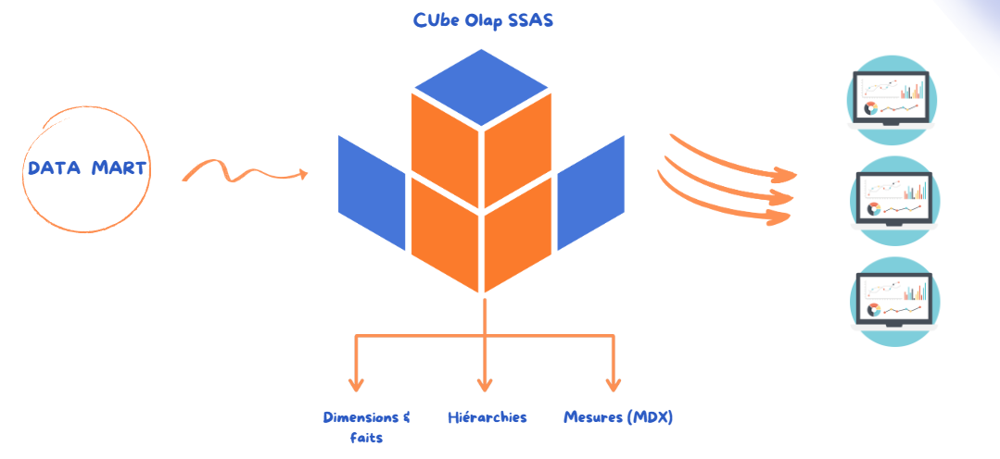

---

## Tableaux de bord Power BI

Les tableaux de bord présentent les analyses des différents Data Marts et permettent une visualisation claire et interactive des indicateurs clés.

---

### Dashboard 1 : Gestion des établissements (Cube 1)
Ce tableau de bord montre les indicateurs clés des établissements :  
- Capacité d’accueil  
- Nombre d’établissements  
- Filières et établissements privés  

Les visualisations présentent :  
- Répartition par **région** et par **type d’établissement**  
- Évolution **annuelle**  
- Durée moyenne des formations  
- Filtrage par région, province, type ou période  

  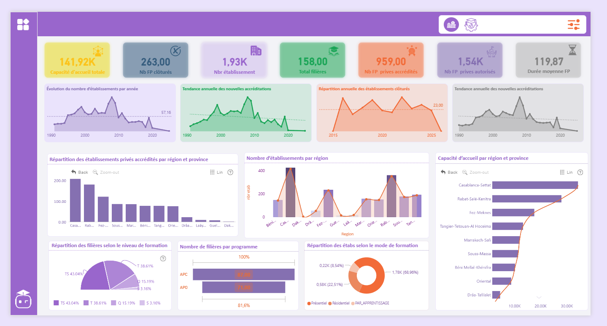
  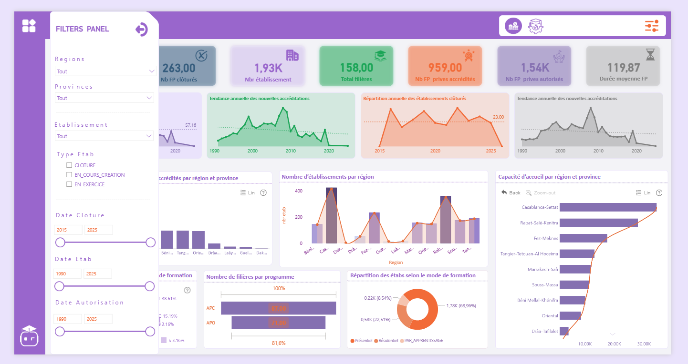
  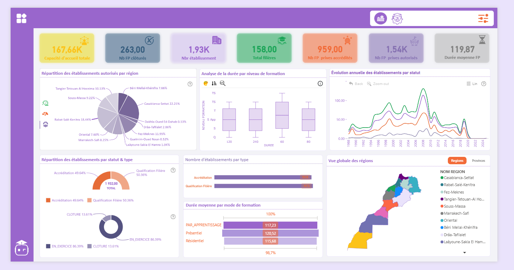

---

### Dashboard 2 : Gestion de la formation (Data Mart 2)
Ce tableau de bord présente les indicateurs de la formation :  
- Nombre d’établissements actifs, filières et formateurs  
- Charge de formation et capacité moyenne d’accueil  
- Évolution des effectifs et ancienneté  
- Répartition géographique des capacités et de la charge globale par région et province  

  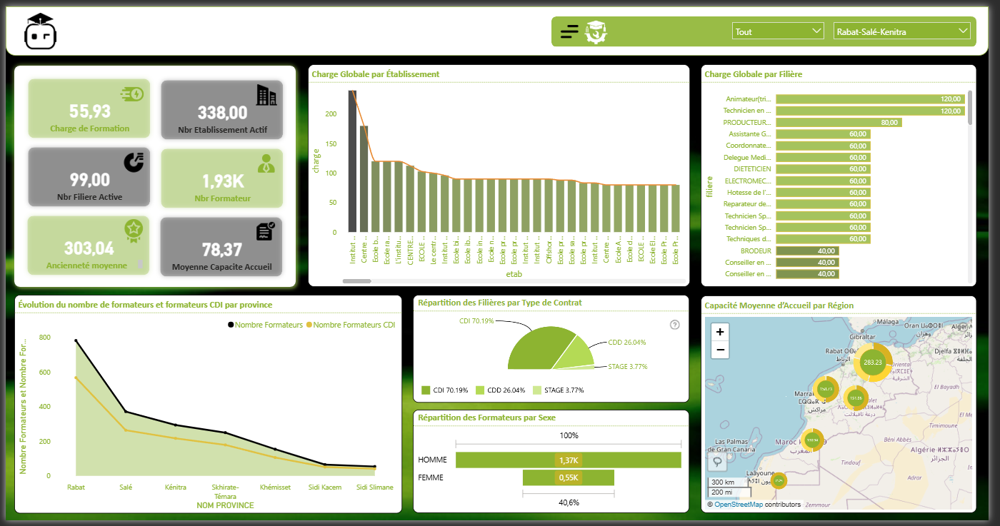
  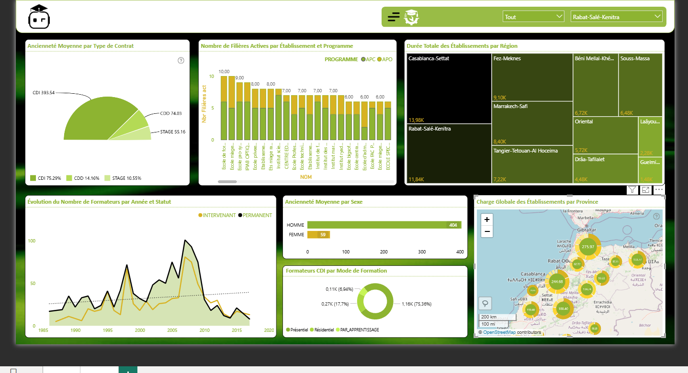

---

### Dashboard 3 : Insertion professionnelle des lauréats (Data Mart 3)
Ce tableau de bord suit l’insertion professionnelle :  
- Taux d’emploi à 9 mois et 3 ans  
- Adéquation formation-emploi  
- Répartition par âge, genre et région  

Le second volet met l’accent sur :  
- Taux de chômage  
- Situation des personnes en situation de handicap  
- Taux de NEET  

  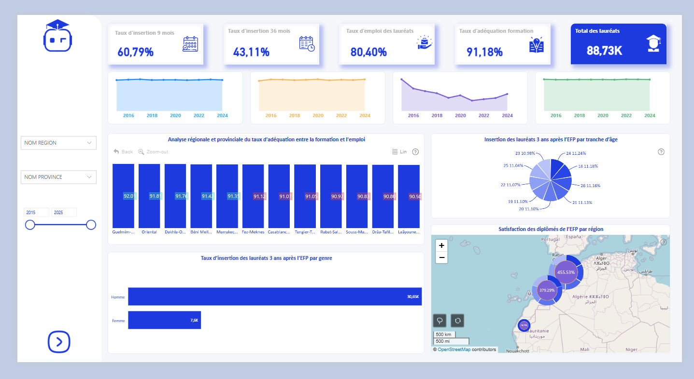
  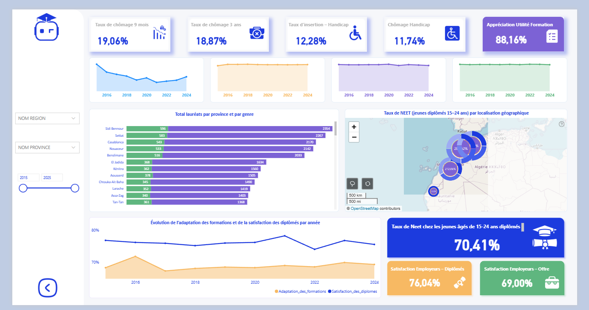

---

### Dashboard 4 : Suivi des stagiaires (Data Mart 4)
Ce tableau de bord permet le suivi des stagiaires :  
- Taux d’encadrement  
- Taux de remplissage  
- Répartition par genre, statut et situation de handicap  

Filtrage possible par **région**, **année scolaire**, ou autres critères pour affiner l’analyse.

  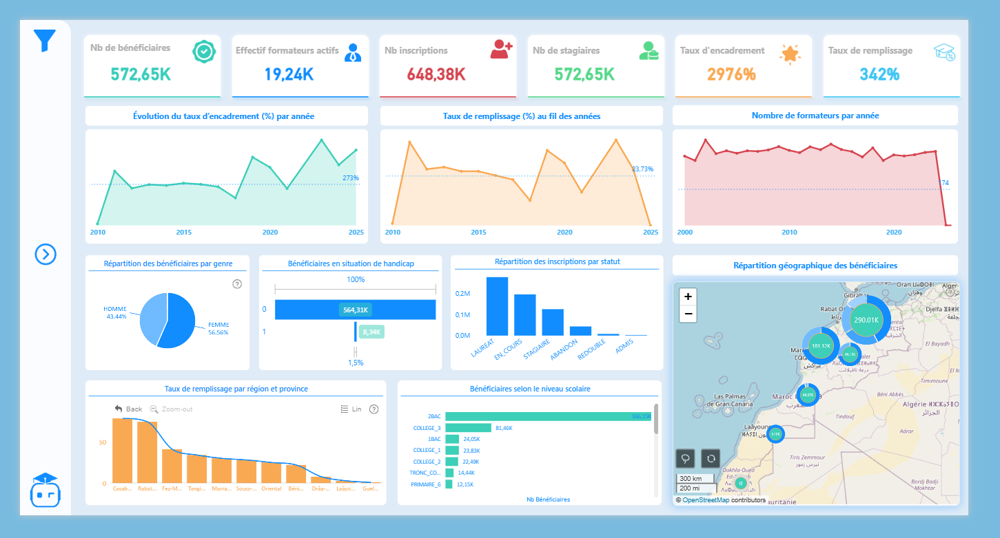
  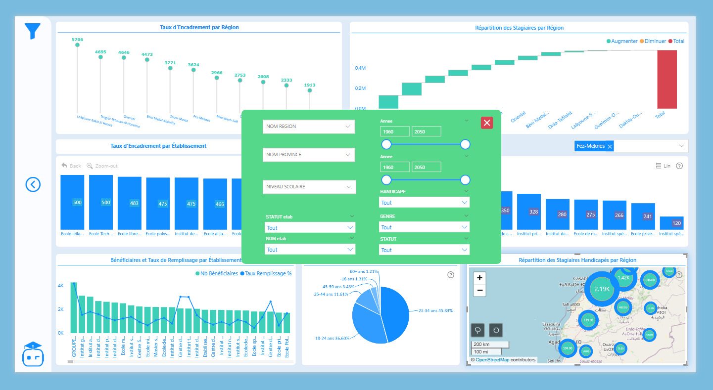

---

## Technologies utilisées
- **MSBI** (SSIS, SSAS, SSRS)  
- **Power BI Desktop / Service**  
- **SQL Server**  
- **ETL automatisés** via SQL Server Agent  
- **Modèle Inmon**, Data Warehouse et Data Marts  
- **MDX** pour les requêtes OLAP

---

## Mots-clés
Business Intelligence, Data Warehouse, Data Mart, Cube OLAP, MSBI, SSAS, Power BI, ETL, Analyse de performance, Inmon, MDX, SSMS
